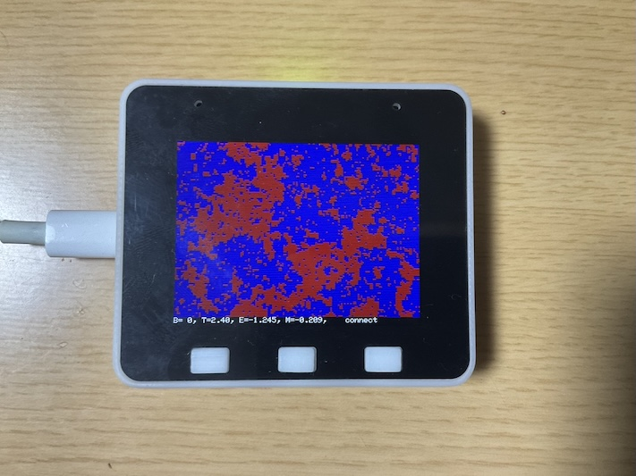
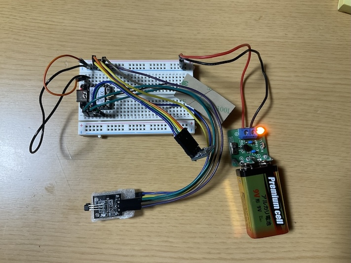

# イジングモデルシミュレーション

このプログラムはイジングモデルを実センサーを用いてシミュレーションするプログラムです。

## 概要

- `esp32-s3-box.ino`: ESP32-S3を使用してイジングモデルをシミュレーションし、LCDディスプレイに結果を表示します。

- `xiao.ino`: センサー（KY-003ホール磁気スイッチと気圧センサー）を使用してデータを取得し、ESP-NOWを介してESP32-S3に送信します。

## 必要なハードウェア

- ESP32-S3
- Seeed XIAO
- KY-003 ホール磁気スイッチ
- BMP085 気圧センサー

## 必要なライブラリ

以下のライブラリをArduino IDEにインストールしてください。

- [LovyanGFX](https://github.com/lovyan03/LovyanGFX)
- [Adafruit BMP085 Library](https://github.com/adafruit/Adafruit-BMP085-Library)

## 使用方法

1. `esp32-s3-box.ino`をESP32-S3に書き込みます。
2. `xiao.ino`をSeeed XIAOに書き込みます。
3. 必要なセンサーを接続し、デバイスを起動します。
4. ESP32-S3のLCDディスプレイにイジングモデルのシミュレーション結果が表示されます。

## プログラムの仕組み

### `esp32-s3-box.ino`

- イジングモデルのスピン格子を初期化し、ランダムなスピン状態を生成します。
- メトロポリス法を用いてスピンの状態を更新します。
- ESP-NOWを使用してSeeed XIAOから温度や磁場のデータを受信し、シミュレーションに反映します。
- LCDディスプレイにエネルギーや磁化の状態を表示します。

### `xiao.ino`

- KY-003ホール磁気スイッチとBMP085気圧センサーを使用してデータを取得します。
- ESP-NOWを使用して取得したデータをESP32-S3に送信します。